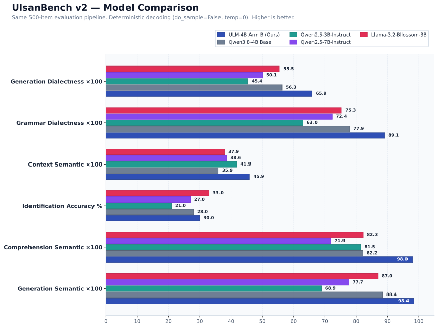

# ULM-4B

UlsanLM Lab의 울산 방언 특화 소형 언어모델 연구 프로젝트입니다.

> 저장소 이름은 초기 1.7B 실험명인 `ULM-1.7B`를 유지하고 있지만, 현재 주력 계열은 Qwen3.8-4B-Distill 기반 ULM-4B입니다.


## 현재 릴리스 후보

현재 데모와 ULM Live 연동에 사용하는 체크포인트는 `ULM-4B Arm B`입니다.

| 항목 | 현재 값 |
| --- | --- |
| Base model | Qwen3.8-4B-Distill |
| Tuning | LoRA SFT |
| Lineage | Dialect Alignment v3 → Context Repair v1 Arm B → Instruction Recovery v1 Arm B |
| Status | Release Candidate |
| Serving | FastAPI / OpenAI-compatible chat API |
| Voice | ULM-LIVE + Qwen3-TTS |
| Thinking | disabled |
| Repetition control | repetition_penalty 1.10 + no_repeat_ngram_size 3 |

Arm B는 울산 방언 생성, 문법, 문맥 응답, 일반 지식 보존을 우선해 고정한 릴리스 후보입니다. instruction-trap 회귀는 아직 남아 있어 연구용 최종 체크포인트로 확정한 상태는 아닙니다.

자세한 수치와 선택 이유는 [Arm B release candidate report](reports/ULM_4B_ARM_B_RELEASE_CANDIDATE.md)와 [MODEL_CARD.md](MODEL_CARD.md)를 참고하세요.

## 평가 요약

| 평가 | Arm B |
| --- | ---: |
| UlsanBench generation semantic | 0.9843 |
| UlsanBench generation dialectness | 0.6589 |
| UlsanBench grammar dialectness | 0.8955 |
| UlsanBench context semantic | 0.4578 |
| Context repetition | 0 |
| Factual QA | 84% |
| Multi-turn | 100% |
| Instruction trap | 65% |
| UlsanBench identification accuracy | 32% |

Context 반복은 기존 greedy decoding에서 발생했지만, 현재 릴리스 디코딩 정책에서는 75개 context 항목에서 0회로 줄었습니다.

## UlsanBench 모델 비교

동일한 500개 평가 항목(UlsanBench v2 held-out split)과 동일한 평가 파이프라인(`sentence-transformers/paraphrase-multilingual-MiniLM-L12-v2` 임베딩 + 종결어미·어휘 규칙 매칭)에서 오픈 모델들을 직접 실행하여 비교한 결과입니다.



> **평가 환경 및 기준 (2026-09-28)**  
> - **하드웨어**: AWS EC2 `g6e.xlarge` (NVIDIA L40S 46GB VRAM, `ap-northeast-2`)
> - **디코딩 조건**: 공정한 비교를 위해 모든 모델에 동일한 결정론적 디코딩(`do_sample=false`, `temperature=0`, `enable_thinking=false`)을 적용했습니다. (ULM-4B 릴리스 디코딩인 Context 반복 제어 적용 수치는 별도 표기)
> - **프롬프트**: 각 모델 공식 토크나이저 chat template 사용, 추가 few-shot 없는 동일 제로샷 지시문 제공
> - **지표 주의**: Semantic similarity 및 Dialectness 점수는 자동 평가 모델(프록시)의 산출물이며, 울산 시민의 실제 주관적 수용도를 직접 측정한 휴먼 평가 점수가 아닙니다. Higher is better.

| 모델 | 파라미터 | Gen Semantic | Gen Dialect | Grammar Dialect | Context Semantic | Identification | Comprehension |
| :--- | :--- | :---: | :---: | :---: | :---: | :---: | :---: |
| **ULM-4B Arm B (중립 디코딩)** | 4.21B | **0.9841** | **0.6591** | **0.8909** | **0.4594** | 0.3000 | **0.9802** |
| **ULM-4B Arm B (릴리스 디코딩\*)** | 4.21B | **0.9841** | **0.6591** | **0.8909** | **0.4656** | 0.3000 | **0.9802** |
| **Qwen3.8-4B-Distill (Base)** | 4.21B | 0.8840 | 0.5629 | 0.7790 | 0.3593 | 0.2800 | 0.8220 |
| **Qwen2.5-3B-Instruct** | 3.09B | 0.6888 | 0.4537 | 0.6303 | 0.4186 | 0.2100 | 0.8150 |
| **Qwen2.5-7B-Instruct** | 7.61B | 0.7766 | 0.5007 | 0.7241 | 0.3859 | 0.2700 | 0.7193 |
| **Llama-3.2-Korean-Bllossom-3B** | 3.21B | 0.8695 | 0.5548 | 0.7530 | 0.3792 | **0.3300** | 0.8228 |

*\* ULM-4B Arm B 릴리스 디코딩: Context 작업에서 `repetition_penalty=1.10`, `no_repeat_ngram_size=3` 적용으로 문맥 반복 0회 달성.*

### 결과 해석
- **방언 생성 및 문법 정렬**: ULM-4B Arm B는 튜닝되지 않은 원본 Base 모델(Qwen3.8-4B) 대비 울산 방언 생성 점수(0.5629 → 0.6591, +0.0962)와 문법 종결 표현 점수(0.7790 → 0.8909, +0.1119)를 크게 향상시켰습니다.
- **의미 보존력 유지**: 방언 변환 시 표준어 원문의 핵심 의미를 보존하는 Generation Semantic(0.9841) 및 방언 이해 Comprehension(0.9802) 지표에서 높은 일관성을 유지했습니다.
- **방언 식별의 한계**: 텍스트만으로 경상도 내 울산 방언과 타 경상 방언을 구분하는 Identification 과제는 비교군 전반에서 21%~33% 수준에 머물렀으며, Bllossom-3B(0.3300)가 ULM-4B(0.3000)보다 소폭 높은 정확도를 보였습니다.
- **종합 분석 보고서**: 전체 500개 세부 추론 로그 및 지연시간, VRAM 등 시스템 성능 측정치는 [ULM-4B 모델 비교 보고서](reports/ULM_4B_MODEL_COMPARISON.md)에서 확인하실 수 있습니다.

## 구조

```text
Browser / Client
       │
       ▼
FastAPI chat server
       │
       ▼
Qwen3.8-4B-Distill
       +
ULM-4B Arm B LoRA
       │
       ├── text response
       │
       └── ULM-LIVE
              │
              ▼
        Qwen3-TTS
              │
              ▼
          24 kHz WAV
```

음성 경로는 별도 저장소 [ULM-LIVE](https://github.com/UlsanLM-LAB/ULM-LIVE)에서 관리합니다.

## 빠른 시작

```bash
uv sync --extra dev --extra ml
uv run pytest
uv run ruff check .
```

모델 가중치와 AI Hub 원본 데이터는 저장소에 포함하지 않습니다.

### Arm B 서버 실행

현재 release candidate는 base model과 LoRA adapter를 분리해서 로드할 수 있습니다.

```bash
export ULM_MODEL_PATH=/path/to/Qwen3.8-4B-Distill
export ULM_ADAPTER_PATH=/path/to/ulm4b-arm-b/final_adapter

uv run python scripts/serve.py \
  --model "$ULM_MODEL_PATH" \
  --host 127.0.0.1 \
  --port 8000
```

상태 확인:

```bash
curl http://127.0.0.1:8000/health
```

비스트리밍 요청:

```bash
curl http://127.0.0.1:8000/v1/chat/completions \
  -H 'Content-Type: application/json' \
  -d '{
    "messages": [{"role": "user", "content": "오늘 뭐하노?"}],
    "stream": false,
    "temperature": 0
  }'
```

SSE 스트리밍도 같은 엔드포인트에서 `"stream": true`로 사용할 수 있습니다.

## 현재 디코딩 정책

Release Candidate에서 반복 루프를 줄이기 위해 다음 설정을 기본으로 사용합니다.

```text
enable_thinking = false
repetition_penalty = 1.10
no_repeat_ngram_size = 3
```

샘플링을 사용할 때는 기존 Phase 4 정책의 `temperature`, `top_p`, `top_k` 설정을 함께 사용합니다.

## 저장소 구성

```text
src/ulm/                 모델 학습·추론 핵심 코드
scripts/                 데이터 구축, 학습, 평가, 서빙 스크립트
configs/                 SFT 및 release 설정
data/                    공개 가능한 메타데이터·benchmark
benchmarks/              평가 설계 및 규칙
reports/                 실험 결과와 의사결정 기록
docs/                    아키텍처 및 운영 문서
portfolio/               포트폴리오용 시각 자료
tests/                   회귀 및 API 테스트
```

실험 산출물과 대형 체크포인트는 Git에 직접 커밋하지 않습니다.

## 주요 문서

- [MODEL_CARD.md](MODEL_CARD.md): 현재 ULM-4B 모델 카드
- [ULM-4B Model Comparison Report](reports/ULM_4B_MODEL_COMPARISON.md): 500개 UlsanBench v2 항목에 대한 원본 Base 및 공개 LLM 비교 벤치마크 결과
- [Arm B release candidate report](reports/ULM_4B_ARM_B_RELEASE_CANDIDATE.md): 현재 고정 후보와 평가 결과
- [PLAN.md](PLAN.md): 연구 목표와 단계
- [EXPERIMENTS.md](EXPERIMENTS.md): 실험 기록 규칙
- [GPU.md](GPU.md): GPU 운영 가이드
- [benchmarks/README.md](benchmarks/README.md): benchmark 작성 및 검수 규칙
- [data/README.md](data/README.md): 데이터 거버넌스

## 현재 상태

ULM-4B Arm B는 텍스트 추론과 ULM Live의 TTS 경로까지 end-to-end 동작을 확인한 release candidate입니다.

다음 우선순위는 instruction-following 회귀 복구, identification 성능 개선, STT 연결, 실시간 음성 스트리밍과 barge-in 지원입니다.

## 라이선스

코드 라이선스는 저장소의 [LICENSE](LICENSE)를 따릅니다. Base model, 데이터셋, 음성 모델은 각각의 원 라이선스와 이용 조건을 별도로 따라야 합니다.
