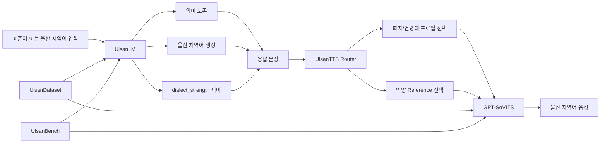
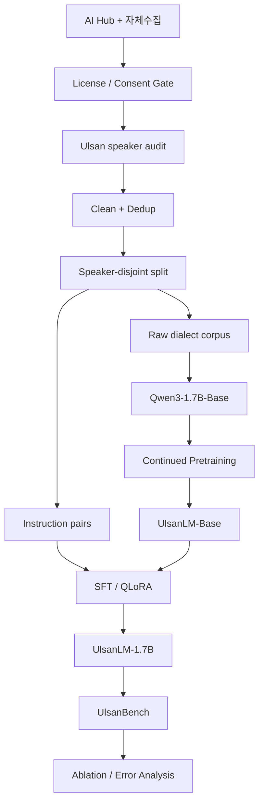
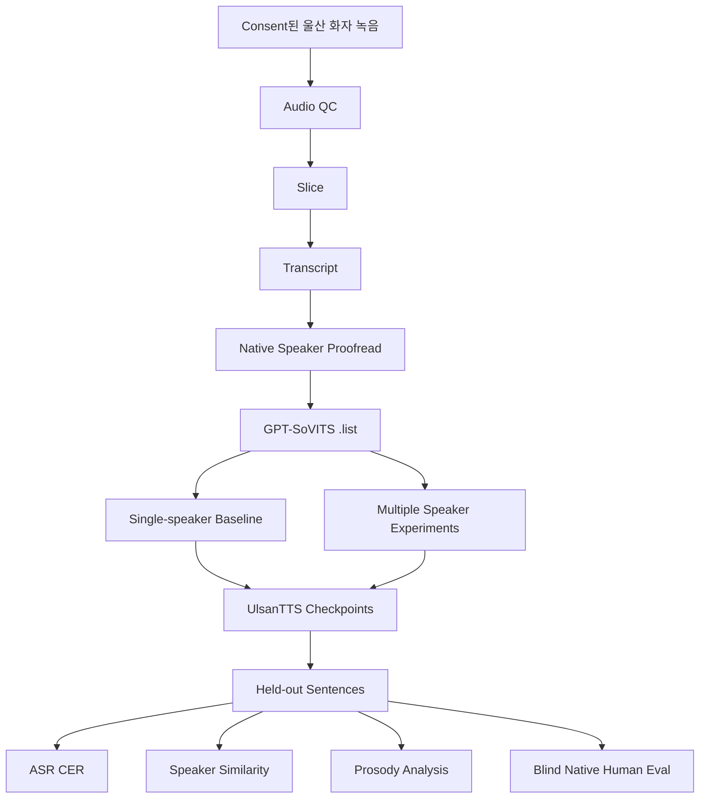
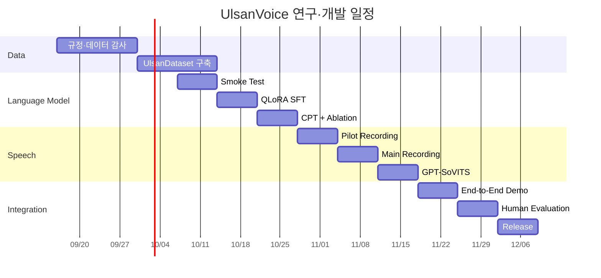

# UlsanVoice: 울산 지역어 SLM + TTS 연구·개발 실행 계획서

## 실행 요약

**UlsanVoice의 가장 좋은 정의는 “울산 사투리를 흉내 내는 챗봇”이 아니라, 울산 지역어를 언어·억양 두 층위에서 모델링하고 이를 정량적으로 평가할 수 있는 지역 특화 음성 AI 연구 프로젝트**다.

권장 최종 구조는 다음과 같다.



데이터 측면에서는 출발점이 상당히 좋다. AI Hub의 **「한국어 방언 발화(경상도)」**는 현재 2,000명 이상의 10~60대 경상권 화자, 3,000시간 이상의 음성, 방언 전사와 표준어 대응 텍스트를 포함하며, 공개된 JSON 스키마에는 `birthplace`, `principal_residence`, `current_residence`, `dialect_form`, `standard_form`, `speaker_id`, 어절별 `isDialect` 등이 존재한다. 따라서 전체를 “경상도 데이터”로 사용하는 대신 실제 다운로드 후 **울산 출생·성장·거주 화자를 메타데이터로 필터링하는 방식**이 가능하다. 다만 AI Hub 공개 페이지에는 “울산 화자 수”나 “울산 음성 시간”이 별도로 집계되어 있지 않으므로, **울산 subset의 정확한 크기는 현재 미상**이며 다운로드 후 audit가 프로젝트 첫 번째 실험이어야 한다. citeturn19search0turn1view0

또한 50대 이상 방언 음성을 강화하기 위해 AI Hub의 **「중·노년층 한국어 방언 데이터(강원도, 경상도)」**를 보조 데이터로 고려할 수 있다. 이 데이터의 경상도 부분은 공개 통계상 약 1,202.9시간, 236,563건의 JSON으로 구성되어 있다. 다만 공개 페이지에서 울산만의 규모가 확인되는 것은 아니므로, 실제 JSON의 시·군·구 혹은 거주지 코드가 울산을 안정적으로 식별할 수 있는지는 다운로드 후 별도로 확인해야 한다. citeturn1view1

언어모델은 **연구용 주 모델 `Qwen/Qwen3-1.7B-Base`, 빠른 MVP용 `Qwen/Qwen3-1.7B`, 파이프라인 검증용 `Qwen/Qwen3-0.6B`** 조합을 권한다. Qwen3-1.7B-Base는 공식적으로 Apache-2.0으로 배포되고 약 3.45GB의 BF16 체크포인트를 제공하며, Qwen3 계열의 1.7B 모델은 약 1.7B 파라미터, 32,768 토큰 컨텍스트를 가진다. Qwen3 모델 카드는 100개 이상의 언어·방언 지원을 표방하지만, 이것이 울산 지역어 성능을 보장한다는 뜻은 아니며, 바로 그 부분을 UlsanBench로 검증해야 한다. citeturn14search0turn14search3turn18view3

가장 중요한 연구 설계는 **“그냥 SFT한 모델”에서 끝내지 않는 것**이다. 최소 다음 네 조건을 비교해야 한다.

| 실험군 | 목적 |
|---|---|
| Qwen3-1.7B 원본 | 무학습 baseline |
| 경상도 전체 SFT | 광역 방언 데이터의 효과 |
| 울산 subset SFT | 지역 세분화의 효과 |
| 울산 CPT → SFT | 지역 언어 자체를 추가 사전학습하는 효과 |

이 설계가 있어야 “울산 데이터가 정말 필요한가?”, “그냥 경상도 파인튜닝이면 충분한가?”, “Continued Pretraining이 실제로 도움이 되는가?”라는 질문에 답할 수 있다.

TTS에는 **GPT-SoVITS를 첫 기준 모델로 사용**하는 것이 합리적이다. 공식 저장소는 한국어를 지원하며, 5초 reference 기반 zero-shot과 약 1분 수준의 few-shot fine-tuning을 주요 기능으로 명시한다. 데이터 리스트 형식도 `audio_path|speaker_name|language|text`이며 한국어 코드 `ko`를 지원한다. 그러나 “1분이면 학습 가능”과 “울산 억양을 신뢰성 있게 학습한다”는 전혀 다른 문제이므로, 연구용 UlsanVoice에서는 최소한 여러 울산 화자의 수 시간 규모 데이터를 직접 구축하는 편이 타당하다. citeturn9view0turn9view1turn9view2

**권장 v1 연구 목표**는 다음이다.

> **UlsanVoice v1 = UlsanLM-1.7B + UlsanDataset + UlsanBench + 동의받은 울산 화자 기반 GPT-SoVITS + dialect strength / voice profile routing + 재현 가능한 학습 코드**

핵심 성공 기준은 “사투리처럼 보이는 출력”이 아니라 다음 네 가지다.

| 성공 기준 | 목표 |
|---|---|
| 의미 이해 | 울산 지역어 입력의 의미를 표준어와 동등하게 보존 |
| 지역성 | 일반 경상도 모델보다 울산 화자 평가에서 높은 자연스러움 |
| 제어성 | `dialect_strength=0~3` 증가에 따라 실제 방언 특징이 단조 증가 |
| 음성성 | 일반 한국어 TTS보다 울산 화자의 “지역 억양 같다” 평가가 유의하게 향상 |

그리고 프로젝트 명칭은 **`UlsanVoice`**를 가장 추천한다. `UlsanLM`은 텍스트 모델 하위 프로젝트명으로 사용하면 좋다.

## 제품·연구 정의와 산출물

UlsanVoice의 독창성은 단순히 “울산말을 한다”가 아니라 **지역 언어의 출처가 확인된 화자 데이터, 텍스트 방언화, 억양 합성, 강도 제어, 지역 판별 벤치마크를 하나의 작은 시스템 안에 결합하는 것**에 있다.

국립국어원은 “지역어”를 특정 지역의 말을 조사할 때 사용하는 개념으로 설명하고 있으며, 실제 지역어 조사 사업도 수행해 왔다. 우리말샘에는 현재 11만 건 이상의 방언 표제어가 등록되어 있고 경남·경북·경상 등 지역별 방언 통계도 제공된다. 반면 이 분류가 곧바로 “울산 전용 AI 학습셋”을 의미하지는 않는다. 따라서 UlsanVoice는 기존 경상권 자원을 **울산 화자 provenance와 직접 수집 데이터로 좁혀 가는 프로젝트**로 잡아야 한다. citeturn14search1turn14search2turn4search0

울산 방언 자체를 별도로 다룬 연구와 사전 편찬 사례도 존재한다. 예를 들어 경주 방언과 울산 방언의 성조를 비교한 연구가 있고, 울산 방언의 고저·장단을 기록하려는 사전 편찬 작업도 알려져 있다. 따라서 “경상도 말 = 울산 말”이라고 가정하는 것은 연구 설계상 피해야 한다. 특히 이 프로젝트가 TTS까지 간다면 어휘·어미뿐 아니라 **F0, 장단, 문장 억양과 같은 음성적 특징을 별도 평가할 이유**가 생긴다. citeturn20search6turn20search0

다만 현재의 공개 웹 검색만으로 “세계 최초 울산 사투리 SLM+TTS” 같은 우선권 주장을 입증할 수는 없다. 실제로 울산 방언을 다루는 소규모 GitHub 프로젝트나 울산 방언 관련 자료는 검색된다. 따라서 논문·포트폴리오에서는 **“최초”보다 “울산 화자 provenance와 텍스트·음성 평가를 결합한 재현 가능한 지역 특화 SLM/TTS 연구”**라고 표현하는 것이 안전하다. citeturn20search10turn20search6

**연구 질문은 다음과 같이 고정하는 것이 좋다.**

`RQ-A`는 *울산 화자 subset으로 파인튜닝한 1.7B 모델이 일반 Qwen3 및 경상도 전체 모델보다 울산 지역어 이해·생성에서 우수한가?*이다.

`RQ-B`는 *울산 원문 Continued Pretraining이 SFT만 수행한 모델보다 어휘·어미·지역 판별 및 perplexity를 개선하는가?*이다.

`RQ-C`는 *울산 화자로 파인튜닝한 TTS가 일반 한국어 TTS보다 울산 청자의 지역 억양 진정성 평가를 향상시키는가?*이다.

`RQ-D`는 *`dialect_strength`를 모델 입력 변수로 넣었을 때 의미 보존을 유지하면서 방언 밀도를 연속적으로 제어할 수 있는가?*이다.

최종 산출물은 다음과 같이 분리하는 편이 좋다.

| 산출물 | 공개 수준 | 내용 |
|---|---|---|
| `UlsanDataset` schema | 공개 | 데이터 스키마, 처리 코드, provenance 규칙 |
| AI Hub 추출 manifest | 기본 비공개 | AI Hub 원본 ID와 내부 경로 |
| 직접 녹음 원본 | 비공개 기본값 | 동의된 경우에만 제한적 공개 |
| `UlsanLM-1.7B` LoRA | 공개 후보 | 텍스트 SFT adapter |
| CPT checkpoint | 공개 후보 | 라이선스 확인 후 공개 |
| `UlsanBench` | 공개 권장 | 직접 제작·권리 확보한 평가셋 |
| `UlsanTTS` checkpoint | 제한 공개 권장 | 화자 동의 수준에 따라 결정 |
| 데모 | 공개 가능 | 고정된 동의 화자만 사용 |
| 연구 보고서 | 공개 | baseline, ablation, human eval 결과 |

AI Hub FAQ는 AI Hub 데이터로 학습한 모델·서비스와 같은 2차 산출물의 활용·배포를 허용하는 방향으로 안내하면서 출처 표기를 요구하지만, **원본 데이터나 단순 가공·변형한 데이터 자체의 재배포는 제한**하고 있다. 따라서 GitHub/Hugging Face에는 AI Hub WAV/JSON이나 이를 거의 그대로 옮긴 JSONL을 올리지 말고, 추출 스크립트와 스키마, 집계 통계, 모델을 공개하는 구조가 안전하다. 실제 다운로드 시 표시되는 해당 데이터셋의 최신 이용조건도 다시 확인해야 한다. citeturn3search0turn3search1

## 데이터 자산과 UlsanDataset 구축

**현재 확보 가능한 데이터 인벤토리**는 다음과 같다.

| 자원 | 실제 용도 | 장점 | 한계 |
|---|---|---|---|
| AI Hub 한국어 방언 발화(경상도) | SLM CPT/SFT, 음성 분석 | 울산 필터에 필요한 화자 메타데이터와 방언↔표준어 대응 | 울산 subset 크기는 공개 통계에 없음 |
| AI Hub 중·노년층 방언(강원·경상) | 고령 화자·억양 보조 | 경상도 부분 약 1,202.9h | 울산 city-level 사용 가능 여부를 실제 JSON에서 검증해야 함 |
| 국립국어원 지역어 조사 자료 | 언어현상·질문지 설계 | 언어학 기반 benchmark 설계 | ML용 자유 배포 corpus로 간주하면 안 됨 |
| 우리말샘 | 방언 lexicon 후보 | 11만+ 방언 표제어 | 공개 통계의 지역 단위가 울산 전용이 아님 |
| 직접 울산 화자 수집 | UlsanTTS, gold benchmark | 지역성·세대·음성 품질 통제 | 비용·동의·녹음 관리 필요 |

AI Hub의 경상도 방언 데이터는 2026년 7월에도 개인정보 비식별화 관련 업데이트가 있었고, 현재 공개 페이지상 2,000명 이상, 3,000시간 이상, 50만 건 수준의 전사 텍스트가 제공된다. 이 점 때문에 오래된 블로그나 예전 구조를 기준으로 스크립트를 작성하지 말고 **현재 내려받은 v1.4 JSON의 실제 key/value를 먼저 audit**해야 한다. citeturn19search0

**울산 필터링에서 가장 중요한 필드는 정확히 다음이다.** AI Hub 공개 스키마에 이 필드들이 명시되어 있다. citeturn1view0

```text
speaker[].id
speaker[].age
speaker[].occupation
speaker[].sex
speaker[].birthplace
speaker[].principal_residence
speaker[].current_residence
speaker[].education

utterance[].id
utterance[].form
utterance[].standard_form
utterance[].dialect_form
utterance[].speaker_id
utterance[].start
utterance[].end
utterance[].note

utterance[].eojeolList[].eojeol
utterance[].eojeolList[].standard
utterance[].eojeolList[].isDialect
```

`name` 필드가 존재하더라도 학습용 파생 manifest에는 보존하지 않는 것을 권한다. 개인정보보호법은 목적에 필요한 최소한의 개인정보만 수집·처리하도록 요구하며, 프로젝트가 실제 이름을 모델링할 이유는 없다. 현재 개인정보보호법은 2026년 9월 11일 시행 버전이 확인되며, 동의를 근거로 수집할 때는 목적, 항목, 보유기간, 동의 거부권 등을 고지해야 한다. citeturn15search1turn15search18

**울산 화자 tier는 다음처럼 정의한다.**

| Tier | 조건 | 사용 |
|---|---|---|
| `U0` | `birthplace=울산` AND `principal_residence=울산` | 핵심 학습·평가 |
| `U1` | `principal_residence=울산` AND `current_residence=울산` | 핵심/보조 |
| `U2` | 세 필드 중 하나만 울산 | 보조, 수동 검토 |
| `GX` | 울산이 확인되지 않는 경상권 화자 | 경상도 baseline |

`principal_residence`를 단순 현재 거주지보다 중요하게 취급하는 이유는 **프로젝트가 현재 주소가 아니라 지역어 습득 배경을 모델링하려 하기 때문**이다. 이것은 AI Hub가 규정한 공식 등급이 아니라 UlsanVoice 자체의 연구 설계다.

첫 실행 시에는 울산 필터부터 적용하지 말고 **고유한 location 값 전체를 먼저 덤프**해야 한다. `"울산"`, `"울산광역시"`, `"울산광역시 남구"`처럼 값 표현이 다를 수 있기 때문이다. `중구`, `남구`처럼 다른 도시에도 존재하는 구 이름만으로 울산을 판별해서는 안 된다.

```python
from pathlib import Path
from collections import Counter
import json
import re

JSON_ROOT = Path("/content/aihub_gyeongsang/json")


def clean_location(x):
    if x is None:
        return ""
    x = str(x).strip()
    x = re.sub(r"\s+", " ", x)
    return x


birth = Counter()
principal = Counter()
current = Counter()

for fp in JSON_ROOT.rglob("*.json"):
    with fp.open("r", encoding="utf-8") as f:
        obj = json.load(f)

    speakers = obj.get("speaker", [])
    if not speakers:
        speakers = obj.get("metadata", {}).get("speaker", [])

    for s in speakers:
        birth[clean_location(s.get("birthplace"))] += 1
        principal[clean_location(s.get("principal_residence"))] += 1
        current[clean_location(s.get("current_residence"))] += 1

print("birthplace:", birth.most_common(100))
print("principal:", principal.most_common(100))
print("current:", current.most_common(100))
```

그 다음 실제 값 사전을 보고 normalization map을 사람이 확정한다.

```python
ULSAN_ALIASES = {
    "울산",
    "울산광역시",
    # 실제 audit 후 확인된 값만 추가
}


def is_ulsan(value: str) -> bool:
    value = clean_location(value)
    return value in ULSAN_ALIASES or value.startswith("울산광역시 ")


def speaker_tier(s):
    b = is_ulsan(s.get("birthplace"))
    p = is_ulsan(s.get("principal_residence"))
    c = is_ulsan(s.get("current_residence"))

    if b and p:
        return "U0"
    if p and c:
        return "U1"
    if b or p or c:
        return "U2"
    return "GX"
```

**“AI Hub에 울산 데이터가 정확히 몇 개 있나?”는 지금 숫자를 추측하면 안 된다.** 공개 페이지가 제공하는 것은 경상도 전체 통계이므로, 다운로드 후 다음 audit CSV를 만들어 답을 확정해야 한다. citeturn19search0turn1view0

```text
tier
unique_speakers
utterances
audio_hours
parallel_pairs
avg_duration_sec
dialect_token_ratio
male/female/unknown
age_distribution
missing_audio
missing_standard_form
missing_dialect_form
```

특히 `eojeolList[].isDialect`가 있기 때문에 화자별·문장별로

```text
dialect_density =
count(isDialect == True) / count(all eojeol)
```

같은 보조 지표를 만들 수 있다. 다만 이것을 곧바로 `dialect_strength` gold label로 사용해서는 안 된다. `isDialect`는 방언 어절 표시이지 **억양의 강도나 화자의 지역성 전체를 나타내는 척도는 아니기 때문**이다. 필드 자체는 AI Hub 공개 스키마에서 확인된다. citeturn1view0

**UlsanDataset 내부 스키마**는 source provenance를 반드시 가지고 있어야 한다.

아래 예시는 AI Hub의 실제 문장을 복사한 것이 아니라 구조 설명용 가상 예시다.

```json
{
  "sample_id": "uls_000001",
  "source": {
    "name": "aihub_gyeongsang",
    "source_sample_id": "internal-only-id",
    "redistributable": false
  },
  "speaker": {
    "speaker_id_hash": "spk_b83f...",
    "ulsan_tier": "U0",
    "age_group": "50s",
    "sex": "F",
    "birthplace_normalized": "울산광역시",
    "principal_residence_normalized": "울산광역시",
    "current_residence_normalized": "울산광역시"
  },
  "utterance": {
    "dialect_text": "니 지금 어데 가노?",
    "standard_text": "너 지금 어디 가?",
    "start_sec": 1.82,
    "end_sec": 3.17
  },
  "annotation": {
    "dialect_density": 0.50,
    "dialect_strength": null,
    "native_reviewed": false
  },
  "split": "train"
}
```

SFT용으로는 별도 변환본을 만든다.

```json
{
  "task": "standard_to_ulsan",
  "controls": {
    "dialect_strength": 2
  },
  "messages": [
    {
      "role": "system",
      "content": "의미를 유지하면서 요청된 강도의 울산 지역어로 표현한다."
    },
    {
      "role": "user",
      "content": "너 지금 어디 가?"
    },
    {
      "role": "assistant",
      "content": "니 지금 어데 가노?"
    }
  ],
  "provenance": "native-reviewed-original"
}
```

이 예문의 울산 고유성 자체를 gold fact로 간주하면 안 된다. 실제 UlsanBench와 고품질 SFT 데이터에서는 **울산 원어민 검수자가 “울산에서 실제로 자연스럽게 쓰는가”를 검증한 문장만** gold로 채택해야 한다.

### 직접 수집 프로토콜

연구용 v1은 **성인 울산 화자 10~12명, 화자당 최종 usable audio 45~60분**, 총 약 8~12시간을 목표로 하는 것을 권한다. GPT-SoVITS 자체는 훨씬 적은 데이터로도 few-shot fine-tuning이 가능하다고 설명하지만, UlsanVoice의 목표는 특정 목소리 복제가 아니라 세대와 화자에 공통되는 지역 억양을 분석하는 것이므로 다화자 구성이 훨씬 중요하다. citeturn9view0turn9view2

화자는 예를 들어 다음 세 층으로 균형 있게 모집한다.

```text
20~39세
40~59세
60세 이상
```

가능하면 성별도 한쪽에 지나치게 치우치지 않도록 한다. 울산 출생 여부, 아동·청소년기의 주 성장 지역, 울산 거주 연수, 부모 세대의 출신 지역은 언어 배경 판단에 유용하지만 **모든 항목이 반드시 필요한지는 목적 최소화 원칙에 따라 결정**해야 한다. 개인정보보호법은 필요한 최소 범위의 개인정보 수집을 요구한다. citeturn15search1

권장 speaker metadata는 다음 수준이면 충분하다.

```json
{
  "speaker_id": "ULS007",
  "age_group": "40-59",
  "gender": "optional",
  "birth_region": "Ulsan",
  "childhood_region": "Ulsan",
  "years_lived_in_ulsan_bucket": "20+",
  "self_dialect_strength": 3,
  "native_panel_score": null,
  "consent_version": "2026-09-v1",
  "permissions": {
    "research_training": true,
    "synthesized_voice": true,
    "public_demo": true,
    "checkpoint_release": false,
    "commercial_use": false
  }
}
```

실명·전화번호·서명 원본은 이 ML manifest와 분리해 저장해야 한다. `speaker_id ↔ 실명` 대응표 역시 별도 암호화 영역에 두고 학습 서버에는 올리지 않는 것을 권한다.

음성은 사람을 식별하는 생체정보로 활용될 가능성이 있고, 개인정보보호위원회도 얼굴·음성·지문 등을 활용하는 생체인식 기술의 오남용 위험을 별도로 다루고 있다. 따라서 “그냥 녹음 동의”보다 **AI 학습, 합성 음성 생성, 공개 데모, 모델 가중치 공개, 상업적 이용을 별도 체크박스로 분리**하는 것이 안전하다. 특히 목소리 원본과 화자 식별용 특징값은 보안 수준을 높여야 한다. citeturn14search4turn16search2turn16search6

현재 개인정보 보호법상 동의를 받는 경우 수집·이용 목적, 수집 항목, 보유·이용 기간, 동의 거부권과 불이익 등을 알려야 하며, 시행령은 동의가 자유로운 의사에 따라 이루어지고 내용이 구체적·명확하며 이해하기 쉬워야 한다고 규정한다. 따라서 실제 동의서는 학교나 기관의 개인정보 담당자/IRB와 함께 검토하는 것이 바람직하다. citeturn15search18turn15search9

권장 consent 항목은 다음이다.

```text
[ ] 연구 목적으로 음성을 녹음하고 저장하는 것에 동의
[ ] SLM/TTS 학습에 사용하는 것에 동의
[ ] 본인의 음성을 기반으로 합성 음성을 생성하는 것에 동의
[ ] 연구 논문/발표에서 비식별 예시를 사용하는 것에 동의
[ ] 공개 웹 데모에서 합성 음성을 사용하는 것에 동의
[ ] 학습된 TTS 가중치를 제3자에게 공개하는 것에 동의
[ ] 상업적 서비스에서 사용하는 것에 동의
```

특히 마지막 세 항목은 묶지 말고 별도로 받아야 한다.

**녹음 규격은 프로젝트 규격으로 다음을 권한다.**

| 항목 | 권장값 |
|---|---|
| Master | WAV PCM |
| 채널 | Mono |
| Capture | 48 kHz / 24-bit |
| 발화 단위 | 주로 2~12초 |
| 마이크 거리 | 약 15~20 cm 고정 |
| 환경 | 조용한 동일 공간 |
| Clip | clipping 없는 파일만 |
| QC 목표 | 가능하면 SNR 30 dB 이상 |
| 원본 보존 | normalize/resample 전 master 유지 |

48 kHz/24-bit가 GPT-SoVITS의 강제 입력 요구사항이라는 뜻은 아니다. **수집 master를 고품질로 보존하고 모델별로 필요할 때 파생본을 생성하기 위한 프로젝트 규격**이다.

녹음 내용은 약 60% prompted paired speech, 30% 자연 대화, 10% 감정·문장 유형 균형으로 시작한다.

```text
표준어 문장 → 화자가 자연스러운 울산말로 재표현
울산 지역 표현 자유 발화
의문문
평서문
감탄문
설명문
짧은 응답
긴 응답
가족·음식·학교·직장·교통·지역 생활 등의 일상 주제
```

“사투리 세게 말해주세요”만 반복하면 배우처럼 과장된 말투를 학습할 위험이 있다. 자연 발화와 prompting을 함께 수집하고, 나중에 다른 울산 화자들이 진정성을 평가해야 한다.

## UlsanBench와 실험 설계

`UlsanBench v1`은 **텍스트 1,500문항 + 음성 120개 핵심 prompt set** 정도가 현실적인 목표다.

텍스트 benchmark를 다음처럼 나눈다.

| Task | 크기 | 평가 대상 | 주 지표 |
|---|---:|---|---|
| `ULS-UNDERSTAND` | 250 | 울산말 의미 이해 | accuracy / human semantic score |
| `ULS-NORMALIZE` | 250 | 울산말 → 표준어 | chrF, semantic score |
| `ULS-GENERATE` | 250 | 표준어 → 울산말 | dialect feature F1 + human |
| `ULS-REGION` | 300 | 울산/부산/대구/경상권 구별 | macro-F1 |
| `ULS-DIALOG` | 250 | 자연스러운 대화 | human preference |
| `ULS-STRENGTH` | 200 | 강도 제어 | monotonicity + meaning |
| **합계** | **1,500** | | |

지역 분류에서는 처음부터 “울산/부산/대구는 모든 문장에서 확실히 구분된다”고 가정하면 안 된다. 판별 불가능하거나 광역 경상권 공통인 문장은 `shared/ambiguous` 클래스를 허용하는 편이 과학적이다.

**예제 형식**은 이런 식이다.

```json
{
  "id": "ULS_UNDERSTAND_0042",
  "task": "dialect_understanding",
  "input": "<울산 원어민 패널이 검수한 실제 지역어 문장>",
  "choices": [
    "의미 A",
    "의미 B",
    "의미 C",
    "의미 D"
  ],
  "gold": "B",
  "phenomena": [
    "ending",
    "lexical"
  ],
  "source": "native_panel",
  "annotators": 3
}
```

`ULS-STRENGTH`는 한 문장을 0~3 수준으로 단순 기계 치환하는 대신, 원어민이 각각 자연스럽게 다시 쓰고 검수해야 한다.

```json
{
  "standard": "오늘은 집에 갈 거야?",
  "variants": {
    "0": "<표준어>",
    "1": "<약한 울산/경상 지역색>",
    "2": "<자연스러운 울산 일상 표현>",
    "3": "<강한 지역 표현>"
  },
  "meaning_equivalent": true,
  "native_review_count": 3
}
```

여기서 중요한 것은 `dialect_strength=3`가 “더 우스꽝스럽게 말하기”가 아니라 **울산 화자가 인정하는 지역적 음운·어휘·어미 특징의 밀도가 높아지는 상태**여야 한다는 것이다.

### Split 규칙

AI Hub의 화자 ID가 제공되므로 **audio/text 모두 speaker-disjoint split**을 최우선으로 해야 한다. AI Hub 데이터에는 `speaker_id`와 각 발화의 시작·종료 시점이 포함되어 있으므로 이를 기준으로 화자 누수를 차단할 수 있다. citeturn1view0

권장 구조는:

```text
Train speakers    80%
Dev speakers      10%
Test speakers     10%

speaker overlap = 0
session overlap = 0
conversation overlap = 0
```

단, 최종 비율은 실제 울산 화자 수 audit 후 바꿀 수 있다. 예를 들어 U0 화자가 20명밖에 없다면 기계적으로 80/10/10을 적용하는 것보다 충분한 test speaker 수를 확보하는 것이 우선이다.

또한 텍스트가 다르더라도 동일한 prompted template의 변형일 수 있으므로 split 전에 **문장 family를 그룹화**한다.

```text
정규화
↓
공백/문장부호 정리
↓
character n-gram similarity
↓
near-duplicate cluster
↓
cluster 단위 split
```

비슷한 문장을 train/test 양쪽에 넣어 결과가 과대평가되는 것을 막기 위해서다.

**UlsanBench의 공개 test는 AI Hub 문장을 그대로 재배포하는 방식으로 만들지 않는 것을 권한다.** AI Hub FAQ의 재배포 제한을 고려하면, 공개 benchmark는 직접 작성하고 울산 원어민이 검수한 문장이나 명시적으로 권리를 확보한 데이터로 구성하는 편이 좋다. citeturn3search0turn3search1

### 실험 matrix

논문형 결과를 얻으려면 최소 다음을 모두 돌린다.

| ID | Model | CPT | SFT data |
|---|---|---|---|
| `B0` | Qwen3-1.7B | 없음 | 없음 |
| `B1` | Qwen3-1.7B | 없음 | 경상도 |
| `U1` | Qwen3-1.7B | 없음 | 울산 |
| `U2` | Qwen3-1.7B-Base | 울산 | 울산 |
| `U3` | Qwen3-1.7B-Base | 울산+일반 한국어 mix | 울산 |

그러면 `B1 vs U1`이 “지역 특화의 효과”, `U1 vs U2`가 “CPT의 추가 효과”, `U2 vs U3`가 “catastrophic forgetting 완화를 위한 general-Korean mixing 효과”가 된다.

## 모델·학습·Colab/RunPod 파이프라인

### 모델 선택

**주 모델은 Qwen3-1.7B를 추천한다.** 공식 Base 체크포인트가 존재하고 Apache-2.0이며, post-trained 1.7B 모델도 제공되므로 CPT 실험과 빠른 SFT 실험을 같은 모델 family 안에서 비교하기 쉽다. Qwen3 공식 카드에는 1.7B 모델이 28 layers, GQA 구조, 32,768 context를 가진 것으로 설명되어 있다. citeturn14search0turn14search3

권장 역할은 다음이다.

| 모델 | 역할 | 판단 |
|---|---|---|
| `Qwen3-0.6B` | Colab smoke test | 강력 추천 |
| `Qwen3-1.7B` | 빠른 SFT MVP | 강력 추천 |
| `Qwen3-1.7B-Base` | CPT→SFT 연구 | **최종 주 모델** |
| Gemma 3 1B | compact baseline | 선택 |
| SmolLM3-3B | 재현성/open-training baseline | 선택 |

Qwen3-0.6B는 Apache-2.0이며 0.6B 규모라 전처리와 SFT 코드가 정상 동작하는지 빠르게 확인하기 좋다. citeturn18view3turn18view4

Gemma 3 1B는 140개 이상의 언어를 지원한다고 Google 모델 카드에 기재되어 있어 multilingual 비교 모델로 가치가 있지만, Hugging Face에서 Gemma 사용 조건에 동의해야 하고 라이선스도 Apache-2.0이 아니라 Gemma license다. 따라서 공개 파생모델 운영의 간결성까지 고려하면 Qwen을 주 모델로 유지하는 편이 편하다. citeturn18view0turn18view1

SmolLM3-3B는 Apache-2.0이고 학습 데이터 mixture와 training config를 비교적 폭넓게 공개한 점이 연구 재현성에는 좋다. 그러나 공식 카드에서 native 지원의 중심으로 열거하는 언어에는 한국어가 들어 있지 않으므로, 울산 한국어 프로젝트의 첫 모델로는 Qwen보다 우선순위를 낮추는 것이 합리적이다. citeturn17view0

### 학습 파이프라인



Hugging Face TRL의 `SFTTrainer`는 일반 텍스트 형식과 conversational `messages` 형식을 지원하고 PEFT/LoRA 학습을 지원한다. 공식 문서는 Qwen3 예제를 제공하고, PEFT adapter 훈련에서는 완전 파인튜닝보다 높은 학습률, 예컨대 `1e-4` 수준을 일반적인 시작점으로 설명한다. 또한 알려진 Qwen chat template에서는 assistant-only loss를 사용하는 방법도 제공한다. citeturn6view0

4-bit QLoRA에서는 bitsandbytes 공식 문서가 **NF4를 4-bit base-model training에 권장**하고 있으며, 지원 GPU에서는 `bfloat16` compute dtype을 사용할 수 있다. nested/double quantization도 추가 메모리 절약 기능으로 제공된다. citeturn7view0turn7view1

**MVP SFT 권장 시작 설정**은 다음과 같다. 이것은 공식 최적값이 아니라 UlsanVoice가 탐색을 시작할 연구 configuration이다.

| Parameter | 시작값 |
|---|---:|
| base | `Qwen/Qwen3-1.7B` |
| quant | 4-bit NF4 |
| double quant | `True` |
| compute | BF16 가능 시 BF16 |
| max seq | 1024 |
| batch/device | 2 |
| grad accumulation | 8 |
| effective batch | 16 samples |
| LoRA rank | 32 |
| LoRA alpha | 64 |
| LoRA dropout | 0.05 |
| target | all linear layers |
| LR | `1e-4` |
| epochs | 2 |
| warmup ratio | 0.03 |
| scheduler | cosine |
| weight decay | 0.01 |
| packing | `True` |
| gradient checkpoint | `True` |

이 설정을 고정값으로 믿으면 안 되고, `r={16,32,64}`, `lr={5e-5,1e-4,2e-4}`, `epochs={1,2,3}` 정도의 작은 탐색을 수행한다.

**CPT는 post-trained 모델이 아니라 `Qwen3-1.7B-Base`에서 시작**하는 것이 실험 해석이 깔끔하다. Base 체크포인트가 공식적으로 제공되며 Apache-2.0이다. citeturn14search0

권장 CPT 시작값:

| Parameter | QLoRA CPT |
|---|---:|
| model | `Qwen3-1.7B-Base` |
| objective | next-token prediction |
| sequence | 2048 |
| packing | yes |
| quant | NF4 4-bit |
| rank | 32 또는 64 |
| alpha | 64 또는 128 |
| LR | `2e-5 ~ 1e-4` 탐색 |
| epochs | 1~2 |
| warmup | 3% |
| dialect/general mix | 실험 변수 |
| validation | held-out Ulsan + 표준 한국어 |

CPT용 텍스트가 극히 적으면 같은 문장을 여러 epoch 반복하는 것보다 CPT 자체를 생략하고 SFT에 집중하는 편이 나을 수 있다. 따라서 **울산 U0/U1 corpus의 tokenizer 기준 실제 token count를 측정한 뒤 CPT 여부를 결정**한다.

권장 의사결정 규칙은 연구용 heuristic으로 다음과 같다.

```text
< 1M usable Ulsan tokens
→ CPT는 ablation 정도만 실시
→ SFT + 직접수집에 집중

1M~10M
→ QLoRA CPT 실험 가치 있음

> 10M
→ CPT를 본 실험축으로 운영
→ 가능하면 full-BF16 CPT도 비교
```

### Colab에서 실행할 QLoRA notebook

Google Colab은 무료 GPU를 제공할 수 있지만 GPU 종류·한도는 고정되지 않고 사용량에 따라 변하며, 무료 managed runtime은 일반적으로 최대 약 12시간 범위에서 종료될 수 있다. 따라서 long training보다 **0.6B smoke test와 1.7B QLoRA SFT**에 사용하는 편이 적합하다. 또한 Drive에 수천·수만 개의 작은 파일을 직접 두고 지속적으로 읽는 것은 I/O 문제를 일으킬 수 있으므로, archive/Parquet 형태로 `/content`에 복사해 풀어 쓰는 구조를 권한다. citeturn12search0

Notebook은 다음 셀 순서를 고정한다.

```text
Cell A  GPU / CUDA 확인
Cell B  package install
Cell C  Google Drive mount / Hugging Face auth
Cell D  dataset archive를 /content로 복사
Cell E  AI Hub schema audit
Cell F  울산 speaker filtering
Cell G  dataset validation / split
Cell H  baseline inference 저장
Cell I  QLoRA model load
Cell J  training
Cell K  checkpoint → Drive backup
Cell L  UlsanBench evaluation
Cell M  adapter export + config 저장
```

설치:

```bash
!pip install -U \
  "transformers>=4.51.0" \
  datasets \
  accelerate \
  peft \
  trl \
  bitsandbytes
```

Qwen3 공식 모델 카드는 초기 Qwen3 지원을 위해 Transformers 4.51.0 이상을 요구한다고 안내한다. 실제 연구에서는 실험 시작 시점의 동작 버전을 `requirements-lock.txt`에 고정해 재현성을 확보해야 한다. citeturn14search3

QLoRA 최소 예시는 다음과 같다.

```python
import torch
from datasets import load_dataset
from transformers import (
    AutoModelForCausalLM,
    AutoTokenizer,
    BitsAndBytesConfig,
)
from peft import (
    LoraConfig,
    prepare_model_for_kbit_training,
)
from trl import SFTConfig, SFTTrainer

MODEL_ID = "Qwen/Qwen3-1.7B"
OUTPUT_DIR = "/content/ulsanvoice-qwen3-1.7b"

bf16 = torch.cuda.is_available() and torch.cuda.is_bf16_supported()
compute_dtype = torch.bfloat16 if bf16 else torch.float16

bnb_config = BitsAndBytesConfig(
    load_in_4bit=True,
    bnb_4bit_quant_type="nf4",
    bnb_4bit_use_double_quant=True,
    bnb_4bit_compute_dtype=compute_dtype,
)

tokenizer = AutoTokenizer.from_pretrained(
    MODEL_ID,
    use_fast=True,
)

model = AutoModelForCausalLM.from_pretrained(
    MODEL_ID,
    quantization_config=bnb_config,
    device_map="auto",
)

model.config.use_cache = False

model = prepare_model_for_kbit_training(
    model,
    use_gradient_checkpointing=True,
)

lora_config = LoraConfig(
    r=32,
    lora_alpha=64,
    lora_dropout=0.05,
    bias="none",
    task_type="CAUSAL_LM",
    target_modules="all-linear",
)

dataset = load_dataset(
    "json",
    data_files={
        "train": "/content/data/train.jsonl",
        "validation": "/content/data/dev.jsonl",
    },
)

args = SFTConfig(
    output_dir=OUTPUT_DIR,
    max_length=1024,
    per_device_train_batch_size=2,
    per_device_eval_batch_size=2,
    gradient_accumulation_steps=8,
    num_train_epochs=2,
    learning_rate=1e-4,
    warmup_ratio=0.03,
    lr_scheduler_type="cosine",
    weight_decay=0.01,
    logging_steps=10,
    save_steps=250,
    eval_steps=250,
    eval_strategy="steps",
    save_total_limit=3,
    gradient_checkpointing=True,
    packing=True,
    bf16=bf16,
    fp16=not bf16,
    report_to="none",
)

trainer = SFTTrainer(
    model=model,
    args=args,
    train_dataset=dataset["train"],
    eval_dataset=dataset["validation"],
    peft_config=lora_config,
    processing_class=tokenizer,
)

trainer.train()
trainer.save_model()
tokenizer.save_pretrained(OUTPUT_DIR)
```

TRL은 conversational dataset을 직접 처리할 수 있고 PEFT adapter training도 공식 지원하며, 4-bit model과 LoRA를 조합하는 방식도 문서화하고 있다. PEFT의 LoRA rank는 trainable adaptation capacity를 결정하는 핵심 설정이므로 `r=32`를 정답처럼 고정하지 말고 ablation 대상으로 유지해야 한다. citeturn6view0turn7view3

Colab이 중단될 경우 resume할 수 있게:

```python
trainer.train(resume_from_checkpoint=True)
```

를 사용하고, checkpoint는 local SSD에 생성한 뒤 일정 간격으로 묶어서 Drive로 복사하는 방식이 좋다.

### RunPod 역할

RunPod는 **CPT, 반복 실험, TTS, full-weight merge, human-eval용 대량 inference**를 맡긴다.

2026년 9월 중순 RunPod 공식 가격표에서 보이는 시간당 가격은 예를 들어 RTX A5000 24GB 약 `$0.27/h`, RTX A6000 48GB 약 `$0.53/h`, RTX 4090 24GB 약 `$0.74/h`, A100 PCIe 80GB 약 `$1.59/h` 수준이다. 가격과 availability는 변할 수 있으므로 실제 pod 생성 시 다시 확인해야 한다. citeturn10search0turn11view0turn11view1turn11view2turn11view3

RunPod persistent volume은 **모델/adapter/checkpoint 공간 100~200GB**를 먼저 잡고, AI Hub 전체 원본 저장공간은 다운로드 페이지의 실제 파일 크기를 확인한 후 별도로 산정하는 것을 권한다. AI Hub 공개 페이지에는 현재 데이터 전체 용량이 명확히 노출되지 않으므로 이를 추측해서 예산에 넣지 않는 편이 안전하다. citeturn19search0

## UlsanTTS와 평가 프로토콜

GPT-SoVITS 공식 저장소는 한국어를 지원하고, fine-tuning용 list 파일을

```text
vocal_path|speaker_name|language|text
```

형식으로 정의하며 `ko` 언어 코드를 지원한다. 공식 workflow도 audio slicing → 선택적 denoise → ASR → 수동 교정 → fine-tuning 형태로 제공한다. citeturn9view0turn9view1

예:

```text
/workspace/ulsanvoice/audio/ULS001/000001.wav|ULS001|ko|<검수된 울산 발화>
/workspace/ulsanvoice/audio/ULS001/000002.wav|ULS001|ko|<검수된 울산 발화>
/workspace/ulsanvoice/audio/ULS002/000001.wav|ULS002|ko|<검수된 울산 발화>
```

GPT-SoVITS v1/v2 계열 이후 한국어 지원이 추가되었고 현재 저장소에는 더 최신 V3/V4 계열도 존재한다. 공식 README는 훈련 데이터 품질에 따라 버전별 특성이 다름을 설명하므로, UlsanVoice에서는 “무조건 최신 버전”보다 **v2/v2Pro를 안정 baseline으로 두고 v4를 비교 실험**하는 접근이 좋다. citeturn9view1turn9view2

**중요한 운영 제약이 하나 있다.** 현재 Google Colab FAQ는 managed runtime에서 금지되는 활동 중 하나로 deepfake 생성을 명시한다. 음성 cloning/fine-tuning이 이 정책과 충돌할 위험이 있으므로 **UlsanLM QLoRA는 Colab에서 수행하되, GPT-SoVITS의 화자 cloning/fine-tuning은 Colab managed runtime이 아니라 RunPod·로컬 GPU·자체 관리 서버에서 수행하는 것을 권한다.** citeturn12search0

따라서 다음 명령은 **RunPod/로컬 Linux용**으로 간주한다.

```bash
git clone https://github.com/RVC-Boss/GPT-SoVITS.git
cd GPT-SoVITS

python -m venv .venv
source .venv/bin/activate

pip install --upgrade pip
pip install -r requirements.txt

python webui.py
```

공식 저장소도 `python webui.py`를 통해 전처리·학습 UI를 구동하는 workflow를 제공한다. 재현성을 위해 실제 프로젝트에서는 `main`을 계속 따라가지 말고 **검증한 GPT-SoVITS commit hash를 기록**해야 한다. citeturn9view1

### TTS 단계



첫 pilot은:

```text
3 speakers
× 30 minutes usable speech
≈ 1.5 h
```

정도로 충분하다.

본 실험은:

```text
10~12 speakers
× 45~60 minutes usable speech
≈ 8~12 h
```

를 추천한다.

다화자 합성을 바로 하나의 “universal checkpoint”로 만들기보다 v1에서는 **화자별 checkpoint/reference profile을 명확히 분리하는 전략**을 우선 추천한다. GPT-SoVITS 데이터 형식에 `speaker_name`이 존재한다고 해서 그것만으로 안정적인 명시적 multi-speaker control이 자동 보장되는 것은 아니므로, pooled multi-speaker 모델은 별도 실험으로 검증해야 한다. citeturn9view1

### `dialect_strength`와 `voice_age`

이 두 기능을 GPT-SoVITS 내부 파라미터처럼 구현하는 것은 권하지 않는다.

대신:

```text
dialect_strength
      ↓
UlsanLM이 텍스트 형태를 조절
      ↓
prosody reference bank 선택
      ↓
GPT-SoVITS
```

구조를 사용한다.

```json
{
  "dialect_strength": 2,
  "voice_age": "senior",
  "speaker_profile": "ULS_SENIOR_F_02"
}
```

`dialect_strength`는 예를 들어:

| 값 | 의미 |
|---:|---|
| 0 | 표준어 |
| 1 | 의미 변화 없이 약한 지역색 |
| 2 | 자연스러운 일상 울산 지역어 |
| 3 | 강한 지역 특징, native-reviewed |

`voice_age`는 **한 사람의 음성을 억지로 젊게/늙게 변조하는 기능이 아니라**, 동의받은 해당 연령대 speaker bank를 선택하는 routing variable로 구현하는 것이 윤리적이고 기술적으로도 해석이 쉽다.

즉:

```python
profile = voice_bank.select(age_group=request.voice_age, dialect_strength=request.dialect_strength)
```

처럼 처리한다.

### 텍스트 평가

자동 지표만으로 “사투리가 자연스럽다”를 판단하지 않는다.

`ULS-UNDERSTAND`와 `ULS-NORMALIZE`에는:

```text
Accuracy
chrF
semantic similarity
meaning preservation human score
```

를 사용한다.

`ULS-REGION`에는:

```text
Macro Precision
Macro Recall
Macro F1
Confusion Matrix
```

를 사용한다.

`ULS-GENERATE`에는 참조문과의 BLEU 하나만 쓰지 않고:

```text
annotated dialect feature precision
annotated dialect feature recall
meaning preservation
native authenticity
fluency
```

를 사용한다.

`ULS-STRENGTH`에서는 가장 중요한 지표를 **control monotonicity**로 잡는다.

예:

```text
strength=0 dialect feature density = 0.03
strength=1                         = 0.11
strength=2                         = 0.21
strength=3                         = 0.35
```

처럼 증가하는지를 보되, 동시에 의미 보존 점수가 떨어지지 않아야 한다.

### TTS 자동 평가

권장 automatic suite는:

| 지표 | 목적 |
|---|---|
| ASR CER | 합성 음성 intelligibility proxy |
| duration error | 발화 길이 이상 감지 |
| F0 statistics | pitch contour 분석 |
| energy contour | prosody 비교 |
| speaker embedding cosine | consented 화자의 화자 유사도 |
| silence/clipping rate | synthesis artifact |
| pronunciation error set | 방언 어휘 발음 오류 |

ASR CER는 방언 음성에 대한 ASR 자체의 편향을 포함할 수 있으므로 “음질의 절대값”이 아니라 **같은 ASR로 모델 A/B를 비교하는 보조 지표**로 사용한다.

울산 방언에서 성조·높낮이 연구가 존재하므로 TTS 프로젝트에서는 F0 기반 분석이 특히 의미가 있다. 다만 연구 문헌에서 특정 성조 패턴이 있다고 해서 현대 모든 울산 화자가 똑같은 패턴을 보인다고 가정해서는 안 되며, 직접 수집된 speaker cohort에서 다시 측정해야 한다. citeturn20search6turn20search0

### 사람 평가

최종 판단은 울산 화자 blind evaluation으로 한다.

권장 항목:

```text
자연스러움
1 2 3 4 5

울산 사람의 말처럼 들리는 정도
1 2 3 4 5

문장의 의미가 잘 전달되는 정도
1 2 3 4 5

억양의 자연스러움
1 2 3 4 5
```

화자 similarity는 해당 목소리에 대한 동의가 있는 경우에만 별도로 평가한다.

최소 세 모델을 랜덤 순서로 섞는다.

```text
A. 일반 GPT-SoVITS 한국어 baseline
B. 울산 단일화자 fine-tune
C. UlsanVoice dialect/prosody profile
```

청취자는 어떤 모델인지 모르게 하고, sample order도 randomize한다. 결과는 평균만 제시하지 말고 participant 단위 bootstrap 등으로 95% confidence interval을 함께 산출하는 것을 권한다.

## 비용·일정·규정·리스크와 저장소 설계

### 예상 GPU 시간과 예산

다음은 **성능 보장치가 아니라 연구 계획용 estimate**다. RunPod의 현재 공개 시간당 가격을 기준으로 계산한 뒤 반복 실패를 위한 여유를 별도로 둔 것이다. 현재 공식 페이지에 보이는 예시 가격은 A5000 `$0.27/h`, A6000 `$0.53/h`, RTX 4090 `$0.74/h`, A100 PCIe 80GB `$1.59/h` 수준이다. citeturn10search0turn11view0turn11view1turn11view2turn11view3

| 작업 | 예상 GPU-hours | 추천 GPU | 대략 compute |
|---|---:|---|---:|
| 0.6B smoke tests | 4~8 h | A5000/Colab | `$0~2` |
| 1.7B SFT 반복 | 15~30 h | A5000/4090 | `$4~22` |
| CPT 실험 | 15~40 h | A6000 | `$8~21` |
| TTS pilot + retrain | 15~30 h | A5000/4090 | `$4~22` |
| 평가 inference | 8~15 h | A5000 | `$2~4` |
| **합계** | **약 57~123 h** | 혼합 | **약 `$20~75` 계산상** |

실제 프로젝트에서는 환경 설정 실패, hyperparameter 재실험, checkpoint merge, human-eval 음성 재생성 등을 고려하여 **cloud compute 예산을 `$100~150` 정도 확보**하는 것을 권한다.

원화는 환율 예측이 아니라 **예산 계산 편의상 `$1 = ₩1,400`을 내부 계획 환율로 가정**하면 약 ₩14만~21만원의 cloud reserve에 해당한다.

그러나 이 프로젝트는 GPU보다 **사람 데이터에 돈을 써야 좋은 프로젝트**다.

연구용 v1 내부 예산은 대략 다음과 같이 편성하는 것을 권한다.

| 항목 | 권장 예산 편성 |
|---|---:|
| GPU/cloud | ₩150k~250k |
| 10~12명 녹음 사례비 | ₩800k~1.2m |
| 울산 native annotation/eval | ₩400k~800k |
| 녹음실/마이크/부대비 | ₩0~300k |
| 저장/백업/기타 | ₩100k~200k |
| **권장 총예산** | **약 ₩1.45m~2.75m** |

이는 시장가격 조사 결과가 아니라 **연구팀이 잡아둘 프로젝트 allowance**다. 장비를 이미 보유하고 지인 pilot을 먼저 한다면 MVP 비용은 훨씬 낮출 수 있다.

### 열두 주 일정

프로젝트 시작을 **2026년 9월 16일**로 가정하면 다음과 같다.

| 주 | 날짜 | 핵심 작업 | 완료 조건 |
|---|---|---|---|
| W1 | 9/16–9/22 | 데이터·라이선스·repo 세팅 | Data Governance v0.1 |
| W2 | 9/23–9/29 | AI Hub download/audit, 화자 모집 시작 | Ulsan subset 통계 확정 |
| W3 | 9/30–10/6 | 전처리·split·schema | UlsanDataset v0 |
| W4 | 10/7–10/13 | 0.6B smoke, Bench 초안 | E2E text pipeline 성공 |
| W5 | 10/14–10/20 | 1.7B Ulsan SFT | UlsanLM-SFT v0.1 |
| W6 | 10/21–10/27 | CPT + ablation | CPT/SFT 비교표 |
| W7 | 10/28–11/3 | 화자 pilot 녹음·QC | 3-speaker TTS pilot |
| W8 | 11/4–11/10 | 본 녹음 및 전사 | 8~12h 목표 corpus |
| W9 | 11/11–11/17 | GPT-SoVITS fine-tune | UlsanTTS v0.1 |
| W10 | 11/18–11/24 | SLM/TTS 통합·control | UlsanVoice demo |
| W11 | 11/25–12/1 | native human eval | 통계·failure analysis |
| W12 | 12/2–12/8 | model card, paper, release | UlsanVoice v1 |



### 규정과 공개 정책

AI Hub 원본을 GitHub/Hugging Face에 넣어서는 안 된다. AI Hub는 학습 결과물의 이용은 폭넓게 허용하면서도 원본 또는 단순 재가공 데이터의 외부 공유를 제한하고 출처 표기를 요구한다. 따라서 저장소에는 **downloader/extractor, schema, statistics, synthetic examples**를 넣고 실제 AI Hub manifest는 `.gitignore` 처리해야 한다. citeturn3search0turn3search1

Qwen3-1.7B-Base는 Apache-2.0이므로 기반 모델 측면에서는 비교적 명확하다. GPT-SoVITS 코드 저장소는 MIT 라이선스를 사용하지만, 이것이 **어떤 사람의 목소리로 학습한 checkpoint를 그 사람의 동의 없이 공개해도 된다는 뜻은 아니다.** 프레임워크 라이선스와 데이터·화자 권리는 별개의 문제로 취급해야 한다. citeturn14search0turn9view0

음성 처리에서는 개인정보 보호를 특히 보수적으로 운영해야 한다. 개인정보보호위원회는 음성을 포함한 생체정보 활용에 대해 오남용 및 유출 위험을 강조하고 있고, 현행 개인정보보호법은 목적에 필요한 최소 개인정보 수집과 명확한 동의를 요구한다. 해외 GPU cloud에 원본 음성을 올리는 경우에도 개인정보 처리·국외 이전·위탁 여부를 프로젝트 소속 기관의 개인정보 담당자와 별도로 검토하는 것을 권한다. citeturn14search4turn15search1turn15search9

특히 공개 데모에서는 **사용자가 아무 사람의 reference voice를 업로드해서 복제할 수 있게 하지 말고**, 사전에 동의받은 고정 UlsanVoice speaker profile만 선택하도록 하는 것이 좋다.

```text
좋은 공개 demo
사용자 텍스트
  ↓
ULS-SENIOR-01 / ULS-YOUNG-02 등
동의된 voice profile
  ↓
합성

피해야 할 demo
사용자가 임의 인물 WAV 업로드
  ↓
즉시 voice cloning
```

### 주요 리스크와 대응

| Risk | 왜 문제인가 | 대응 |
|---|---|---|
| 울산 AI Hub sample이 너무 적음 | CPT가 무의미 | audit 후 SFT 중심으로 pivot, 직접수집 확대 |
| “경상도”를 울산으로 오인 | 연구 타당성 붕괴 | U0/U1 provenance + native review |
| 젊은 화자에게 울산 특징 약함 | generation 희석 | 세대 stratification |
| 한 화자를 울산 억양으로 일반화 | speaker/accent confounding | 10~12명 이상, speaker-held-out eval |
| LLM이 가짜 사투리 생성 | stereotype 강화 | 합성 데이터는 반드시 native validation |
| test leakage | 과대 성능 | speaker/session/template family split |
| CPT 후 일반 한국어 저하 | catastrophic forgetting | standard-Korean control set/mixed CPT |
| TTS가 목소리만 복제 | 지역 억양 연구 실패 | accent rating, F0, cross-speaker eval |
| 음성 모델 오용 | impersonation | fixed speaker bank, 별도 동의, checkpoint 제한 |
| AI Hub 재배포 위반 | 공개 불가 | scripts/model만 공개 |
| Colab 종료 | training loss | frequent checkpoints |
| Colab TTS 정책 충돌 | 계정/실행 제한 위험 | TTS는 RunPod/local |

### 권장 repository

가장 좋은 이름은 **`ulsanvoice`**다.

대안은:

| 이름 | 장점 |
|---|---|
| `ulsanvoice` | 짧고 제품/연구 둘 다 가능 |
| `ulsan-voice-lab` | 연구 프로젝트임이 명확 |
| `ulsan-dialect-ai` | 검색 시 목적 명확 |

repo는 처음부터 다음처럼 분리하는 것을 권한다.

```text
ulsanvoice/
├── README.md
├── LICENSE
├── CITATION.cff
├── pyproject.toml
├── requirements/
│   ├── llm.txt
│   ├── tts.txt
│   └── lock.txt
│
├── configs/
│   ├── cpt/
│   │   └── qwen3_1.7b.yaml
│   ├── sft/
│   │   └── qwen3_1.7b_qlora.yaml
│   └── tts/
│       └── gpt_sovits.yaml
│
├── data/
│   ├── README.md
│   ├── schemas/
│   │   ├── ulsan_dataset.schema.json
│   │   └── speaker.schema.json
│   ├── examples/
│   │   └── synthetic_examples.jsonl
│   └── private/
│       └── .gitignore
│
├── src/
│   └── ulsanvoice/
│       ├── data/
│       │   ├── audit_aihub.py
│       │   ├── filter_ulsan.py
│       │   ├── normalize.py
│       │   ├── deduplicate.py
│       │   └── split_by_speaker.py
│       │
│       ├── llm/
│       │   ├── train_cpt.py
│       │   ├── train_sft.py
│       │   ├── merge_adapter.py
│       │   └── inference.py
│       │
│       ├── tts/
│       │   ├── prepare_audio.py
│       │   ├── build_sovits_list.py
│       │   └── router.py
│       │
│       ├── bench/
│       │   ├── evaluate_understand.py
│       │   ├── evaluate_generation.py
│       │   ├── evaluate_region.py
│       │   └── evaluate_tts.py
│       │
│       └── app/
│           └── pipeline.py
│
├── notebooks/
│   ├── colab_qwen_smoke.ipynb
│   ├── colab_qlora_sft.ipynb
│   ├── audit_aihub.ipynb
│   └── evaluation.ipynb
│
├── benchmark/
│   ├── README.md
│   ├── schema/
│   └── public/
│
├── consent/
│   ├── README.md
│   └── template_fields.md
│
├── reports/
│   ├── data_audit/
│   ├── experiments/
│   └── human_eval/
│
└── app/
    └── demo/
```

가장 중요한 첫 milestone은 모델 학습이 아니다.

**프로젝트 시작 후 가장 먼저 아래 파일 하나를 만들어야 한다.**

```text
reports/data_audit/aihub_ulsan_inventory.csv
```

그 안에 실제로

```text
U0 울산 화자 수
U1 울산 화자 수
U2 울산 화자 수

각 tier의 발화 수
각 tier의 총 음성 시간
연령 분포
성별 분포
dialect/standard pair 수
isDialect 비율
누락률
```

이 들어가야 한다.

그 숫자를 확인한 다음에만 “CPT를 할 것인가”, “직접 녹음을 몇 시간 할 것인가”, “UlsanBench를 얼마나 크게 만들 것인가”를 결정해야 한다.

결국 UlsanVoice에서 가장 강한 연구 결과는 **“1.7B 모델을 파인튜닝했다”가 아니다.**

> **경상권 전체로 뭉뚱그려진 기존 자원에서 울산 화자 provenance를 분리하고, 직접 수집한 다화자 음성으로 텍스트 지역성뿐 아니라 억양까지 모델링한 뒤, speaker-disjoint UlsanBench와 울산 원어민 blind evaluation으로 그 효과를 검증했다.**

이 문장을 실제 실험 결과로 증명하는 것이 UlsanVoice v1의 최종 목표다.
