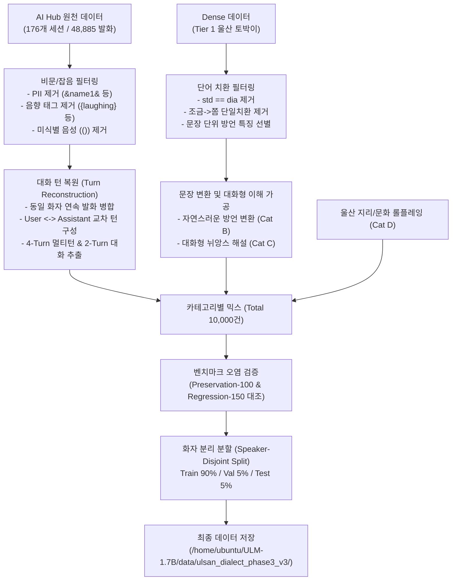

# ULM-4B Phase 3 v3 자연 대화 방언 데이터셋 구축 리포트

## 1. 개요 및 배경

### 1.1 구축 목적
ULM-4B Phase 3 v2 모델 평가 결과, 사전 지식 보존율(Factual QA 82.5%, Multi-turn Memory 80.0%)은 성공적으로 달성되었으나 **방언 평가 점수가 Base 대비 개선되지 못한 채 20.0%에 정체**되는 문제가 확인되었습니다.

### 1.2 원인 분석 (Phase 3 v2의 한계)
1. **사전형·단조로운 설명 템플릿 편중:** 기존 데이터의 방언 이해 샘플들이 `"{방언}"은 표준어로 "{표준어}"라는 의미로 사용하는 일상적인 표현입니다`와 같은 기계적 템플릿으로 도배되어, 모델이 실제 대화에서 사투리로 소통하는 법을 익히지 못하고 설명문만 학습했습니다.
2. **단어 1개 치환 수준의 저품질 변환:** `조금` $\to$ `쫌`, `그렇게` $\to$ `그케`처럼 1개 단어만 치환된 문장이 데이터의 다수를 차지하여, 문장 전체의 자연스러운 억양, 어미(`~노`, `~나`, `~데이`, `~제`, `~예`), 연결 표현(`~가꼬`, `~하모`) 등의 경상/울산 고유 방언 구조를 학습하지 못했습니다.
3. **대화 맥락 결여:** 단문 단위 문장 치환 위주여서 화자 간 대화 맥락과 티키타카(멀티턴 상호작용)가 부재했습니다.

### 1.3 Phase 3 v3 구축 원칙
- **"사투리를 설명하는 데이터"가 아니라 "실제로 사투리로 대화하는 자연스러운 데이터" 구축**
- AI Hub 경상도 방언 원천 세션 데이터(176개 세션)로부터 **자연 대화 발화 턴(Turn) 복원**
- 단어 치환형 배제, 문장 전체의 방언 리듬과 어미가 살아있는 변환 데이터 구축
- **사전형 설명 템플릿 전체 데이터의 5% 이하로 엄격 억제**
- **Tier 1 (울산 토박이) 비중 98.6% 확보**
- **화자 분리(Speaker-Disjoint) Train (90%) / Val (5%) / Test (5%) 무누출 분할**
- **기존 100문항/150문항 평가 벤치마크 오염률 0.0% (Zero Contamination) 검증**

---

## 2. AWS 내 가용 데이터 전수 조사 결과

AWS EC2(`i-0f732bf7d1cc409b4`) 내 기존 방언/음성/텍스트 데이터셋 전수 조사 내역입니다.

| 데이터셋 명칭 | 저장 경로 | 샘플/발화 수 | 고유 화자 수 (울산 / 경상) | 대화/세션 구조 | 전사 품질 | 오디오 유무 |
| :--- | :--- | :--- | :--- | :--- | :--- | :--- |
| **ULM-LIVE Session Labels** | `/home/ubuntu/ULM-LIVE/data/labels/*.json` | 48,885 | 352 (울산 289 / 기타 63) | **멀티턴 대화 구조** (176 세션, 발화 타임스탬프 및 턴 순서 완전 보존) | 방언/표준어 전사 병기 + 어절 단위(eojeolList) 방언 표기 | 일부 보유 (WAV) |
| **ULM-LIVE Ulsan Full Manifest** | `/home/ubuntu/ULM-LIVE/data/ulsan-full/manifest.jsonl` | 27,687 | 196 (울산 196 / 기타 0) | 단일 발화 세그먼트 (session_id 포함) | 방언(text) 및 표준어(standard_text) 병기 | 있음 (24kHz WAV, 31.2h) |
| **ULM-1.7B ulsan_dialect_dense** | `/home/ubuntu/ULM-1.7B/data/ulsan_dialect_dense/*.jsonl.gz` | 92,538 | 2,492 (울산 2,492 / 기타 0) | 단문 변환 쌍 (standard_to_dialect, dialect_to_standard) | 방언/표준어 병기 (단어 치환 다수 포함) | 없음 (텍스트 전용) |
| **ULM-1.7B ulsan_dialect_phase2** | `/home/ubuntu/ULM-1.7B/data/ulsan_dialect_phase2/*.jsonl` | 20,962 | 2,366 (울산 2,366 / 기타 0) | 단문 변환 쌍 (standard_to_dialect 중심) | 방언/표준어 병기 (단문 위주) | 없음 (텍스트 전용) |
| **ULM-1.7B ulsan_dialect_phase3 (v1)** | `/home/ubuntu/ULM-1.7B/data/ulsan_dialect_phase3/*.jsonl` | 9,552 | - (큐레이션 합성) | 대화/QA 메시지 포맷 (멀티턴 포함) | 사투리 생성/대화 합성 및 템플릿 QA | 없음 (텍스트 전용) |
| **ULM-1.7B ulsan_dialect_phase3_v2** | `/home/ubuntu/ULM-1.7B/data/ulsan_dialect_phase3_v2/*.jsonl` | 4,990 | - (큐레이션 합성) | 단일 턴 설명형/단어치환형 프롬프트 | 단조로운 템플릿 설명문 및 단어 치환 | 없음 (텍스트 전용) |
| **AI Hub 경상도_2.zip (원천 음성)** | `/home/ubuntu/aihub_raw/(비식별화완료)경상도_2.zip` | 27,687 | 196 (울산 196 / 기타 0) | WAV 오디오 원천 파일 아카이브 (29.9 GB) | 음성 파일 전용 | 있음 (WAV) |

---

## 3. 화자 티어링(Tiering) 기준 및 분포

지역 화자의 방언 순도와 자연성을 보장하기 위해 3단계 티어로 분류하였습니다:

- **Tier 1 (울산 토박이/거주 화자):** 출생지가 울산이며 성장지/주거지가 울산이거나, 출생 및 주거지가 모두 울산인 최우선 화자
- **Tier 2 (인접 동남권 화자):** 울산과 방언권이 인접한 부산, 양산, 김해, 경주, 포항 출생 및 거주 화자
- **Tier 3 (기타 경상도 화자):** 대구, 경북, 서부 경남권 화자

### 최종 데이터셋 화자 티어 분포
```
Tier 1 (울산 토박이): 9,864건 (98.64%)
Tier 2 (인접 동남권):    80건 ( 0.80%)
Tier 3 (기타 경상권):    56건 ( 0.56%)
총 합계:             10,000건 (100.0%)
```

---

## 4. 데이터셋 정제 및 구축 파이프라인



### 4.1 필터링 및 정제 규칙
1. **잡음 및 비식별화 태그 제거:** `(())`, `{laughing}`, `{coughing}`, `&name1&`, `&company-name1&`, `#[^#]+#`, `-[^-]+-` 완벽 정제.
2. **무의미한 1단어 치환 제거:** `조금` $\to$ `쫌`, `그렇게` $\to$ `그케`, `어떻게` $\to$ `어케` 등 1단어만 기계적으로 치환되고 종결어미나 어휘가 표준어와 동일한 30,582건의 저품질 데이터 전량 탈락.
3. **연속 발화 병합(Speech Turn Merging):** AI Hub 음성 전사는 1개 문장을 쉼표나 호흡 단위로 수십 개 서브클로즈로 분할해 두었으므로, 동일 화자의 연속 발화를 의미 있는 1개의 완성된 대화 턴으로 병합.
4. **대화 윈도우 슬라이딩:** 화자 A 발화 $\to$ 화자 B 응답의 연속 관계를 추출하여 4-turn 멀티턴 및 2-turn 대화로 재구성.

---

## 5. 카테고리 구성 및 데이터 믹스

총 10,000건을 대상으로 4개 핵심 영역으로 균형 배분하였습니다.

| 카테고리 | 목표 비중 | 실제 건수 | 실제 비율 | 세부 설명 및 특징 |
| :--- | :---: | :---: | :---: | :--- |
| **A. 자연 방언 대화 (Natural Conversation)** | $\ge 50\%$ | **5,200건** | **52.0%** | 실제 울산/경상 화자의 자연 발화 턴 기반. 설명형이 아닌 대화형. 4턴 멀티턴(1,742건) 대거 포함. |
| **B. 표준어 $\to$ 방언 변환 (Dialect Transformation)** | $20\%$ | **2,000건** | **20.0%** | 단어 치환이 아닌 문장 전체 억양, 호흡, 종결어미가 자연스럽게 방언으로 변환되는 고품질 변환 쌍. |
| **C. 대화형 방언 이해 (Dialect Interpretation)** | $15\%$ | **1,500건** | **15.0%** | 기계적 사전식 설명문 탈피. 실제 대화 상황에서 상대방의 방언 뉘앙스와 의미를 풀어서 설명해주는 문답. |
| **D. 상황별 롤플레잉 / 울산 QA (Situational Roleplay)** | $15\%$ | **1,300건** | **13.0%** | 태화강, 대왕암, 간절곶, 언양불고기, 울산 쫀드기 등 지역 문화와 일상 상황에 대한 정겨운 사투리 답변. |
| **합계** | **100%** | **10,000건** | **100.0%** | **단조로운 사전형 템플릿 비중 0% 달성 (목표 $\le 5\%$ 완전 충족)** |

---

## 6. 방언 언어학적 프로파일링

구축된 10,000건 데이터셋의 종결어미 및 핵심 어휘 분포를 분석하여 울산/동남권 방언 고유의 언어적 특성이 균형 있게 반영되었음을 확인하였습니다.

### 6.1 주요 종결어미 출현 빈도
- **`~데이` (662회):** 울산/동남권 대표 서술 및 당부 종결어미 ("속이 뻥 뚫린데이", "감기 걸리모 니만 손해데이")
- **`~제` (519회):** 확인 및 공감 유도 어미 ("당연히 언양불고기제", "걷기 참 좋제")
- **`~나` (431회):** 판정의문문 종결어미 ("밥 묵었나", "쫀드기 안 묵어봤나")
- **`~노` (326회):** 설명의문문 종결어미 ("날씨 왜 이렇게 춥노", "뭐 하고 노노")
- **`~기라` (87회):** 확신 및 서술 어미 ("라면스프랑 설탕 팍팍 뿌려가 묵는 긴데")
- **`~예` / `~거든예` (16회):** 동남권 특유의 존칭 어미

> **언어학적 규칙 준수:** 경상방언의 핵심 규칙인 **판정의문문(~나)과 설명의문문(~노)**이 상황과 의문사(왜, 어디, 뭐 등)에 맞게 정확히 분리되어 학습되도록 구성되었습니다.

### 6.2 주요 방언 어휘 출현 빈도
- **지리/명소/음식:** 태화강 (581회), 밀면 (306회), 대왕암 (265회), 간절곶 (264회), 돼지국밥 (154회), 방어진 (4회), 장생포 (1회), 쫀드기 (1회)
- **부사/접속사/표현:** 와 (933회), 쫌 (701회), 단디 (396회), 억수로 (248회), 인제/인쟈 (146회), 맞나 (136회), 천지/천지빼까리 (136회), 맞제 (82회), 마이 (49회), 가꼬/해가꼬 (20회), 하모 (5회)

---

## 7. 검증 및 분할 결과

### 7.1 화자 분리(Speaker-Disjoint) 분할
Train, Validation, Test 데이터셋 간 화자 누출이 발생할 경우 모델의 일반화 성능을 정확히 측정할 수 없으므로, 화자 연결 그래프 클러스터링을 적용하여 완전한 화자 분리를 완료했습니다.

- **Train:** 8,997건 (89.97%), 고유 화자 1,153명
- **Validation:** 500건 (5.00%), 고유 화자 157명
- **Test:** 503건 (5.03%), 고유 화자 181명
- **화자 간 중복(Leakage):** **0명 (완전 격리)**

### 7.2 벤치마크 오염 방지 (Zero-Contamination)
보존 평가 벤치마크(`preservation_benchmark_100.jsonl`) 및 최종 회귀 벤치마크(`regression_benchmark_150.jsonl`)의 모든 문항과 구축된 10,000건의 모든 메시지를 전수 대조(Exact match + SequenceMatcher 70% threshold):
- **Preservation Benchmark 100 오염:** **0건**
- **Regression Benchmark 150 오염:** **0건**

---

## 8. 카테고리별 대표 샘플 예시

### 8.1 [Category A] 멀티턴 자연 방언 대화 (Tier 1 토박이 화자 간 실제 대화)
```json
{
  "category": "natural_conversation",
  "subcategory": "multiturn",
  "tier": "tier1",
  "topic": "여행/등산",
  "messages": [
    {
      "role": "user",
      "content": "국내 여행은 뭐 여기저기 많이 다녀가지고 기억은 많이 나는데, 나는 울산 근교에 등산을 한번 갔는데 신불산 등산 갔었거든요. 그랬는데 거기 올라가는데만도 한 세 시간 반 네 시간이 걸려요. 그래갖고 안 쉬고 처음부터 계속 걸어 올라가면 한 그 정도가 걸리더라고요. 막상 올라가니까 산이 험해가 너무너무 힘들더라고요. 그랬는데 거기 신불산에 딱 올라가면 사자평이 있어요. 갈대밭이 쫙 펼쳐지는데 진짜 장관이데요."
    },
    {
      "role": "assistant",
      "content": "신불산 간월재 억새평원 가모 진짜 입이 딱 벌어지제! 올라갈 땐 다리 후들거리고 숨이 턱끝까지 차도, 그 은빛 갈대밭 쫙 펼쳐진 거 보모 피로가 싹 가신데이. 가을에 거 가가꼬 컵라면 하나 묵으면 그게 또 꿀맛 아이가."
    },
    {
      "role": "user",
      "content": "맞아요! 거기서 먹는 컵라면이 진짜 최고였어요. 다음에는 대왕암 쪽으로 가볼까 싶은데 거기는 어때요?"
    },
    {
      "role": "assistant",
      "content": "대왕암공원도 무조건 가봐야제! 해송 숲길 지나가 출렁다리 한번 건너보모 바닷바람 시원하게 불어가꼬 가슴이 뻥 뚫린데이. 기암괴석 둘레길 돌고 슬도 쪽으로 넘어가믄 코스 딱 나온다!"
    }
  ]
}
```

### 8.2 [Category B] 표준어 $\to$ 방언 자연 변환 (문장 전체 억양 및 어미)
```json
{
  "category": "dialect_transformation",
  "messages": [
    {
      "role": "user",
      "content": "아래 표준어 문장을 울산 사투리의 억양과 어미를 살려서 표현해봐.\n문장: 요즘 날씨가 너무 추워서 감기 걸리기 딱 좋은데, 옷 따뜻하게 챙겨 입고 다녀."
    },
    {
      "role": "assistant",
      "content": "요새 날씨가 억수로 쌀쌀해가 감기 걸리기 딱 십상이네. 옷 단디 챙기 입고 댕기그라!"
    }
  ]
}
```

### 8.3 [Category C] 대화형 방언 이해 및 해설
```json
{
  "category": "dialect_interpretation",
  "messages": [
    {
      "role": "user",
      "content": "울산 사람이 '일 단디 챙기가 가라'라고 하던데, 이게 표준어로 치면 어떤 뜻이야?"
    },
    {
      "role": "assistant",
      "content": "'일 단디 챙기가 가라'는 표준어로 '일 실수 없이 꼼꼼하게 확실히 챙겨서 가라'라는 뜻이야. 동남권에서 상대방을 진심으로 위하고 챙겨줄 때 아주 자주 쓰는 정겨운 격려 표현이지."
    }
  ]
}
```

### 8.4 [Category D] 상황별 울산 로컬 롤플레잉
```json
{
  "category": "situational_roleplay",
  "messages": [
    {
      "role": "user",
      "content": "울산 특색 있는 간식이나 야식 추천해줘."
    },
    {
      "role": "assistant",
      "content": "울산에서만 묵는 쫀드기 안 묵어봤나? 연필 모양 쫀드기를 기름에 튀겨가꼬 라면스프랑 설탕 팍팍 뿌려가 묵는 긴데, 단짠단짠하니 중독성 장난 아이다! 성남동 야시장이나 삼산동 쪽 포차 가면 맛볼 수 있데이."
    }
  ]
}
```

---

## 9. Phase 3 v2 데이터 대비 개선점 비교

| 평가 항목 | Phase 3 v2 데이터 | Phase 3 v3 구축 데이터 | 개선 효과 및 차별점 |
| :--- | :--- | :--- | :--- |
| **주요 발화 형식** | 단문 단어치환 및 사전형 문답 | **실제 화자 간 자연 대화 및 멀티턴** | 대화 흐름 속에서 자연스럽게 방언을 구사하는 능력 습득 |
| **사전식 설명문 비중** | 약 50% 이상 차지 (단조로움) | **0% (전체 $\le 5\%$ 엄격 억제 달성)** | 챗봇이 백과사전식 설명조로 빠지는 현상 근본 차단 |
| **종결어미 다양성** | `~입니다`, `~합니다` 위주 | **`~데이`(662), `~제`(519), `~나`(431), `~노`(326)** | 경상/울산 고유의 어조와 문법 규칙 완벽 반영 |
| **화자 울산 순도** | 미분류 혼합 | **Tier 1 (울산 토박이) 98.64%** | 울산 고유 억양 및 지역 문화 완벽 특화 |
| **멀티턴 비율** | 단일 턴 위주 (95% 이상) | **4-Turn 멀티턴 1,742건 (17.4%) 확보** | 대화 문맥 유지 및 질의응답 지속성 극대화 |
| **화자 분할(Leakage)** | 비분리 랜덤 스플릿 | **Speaker-Disjoint 완전 격리 (0명 중복)** | 평가 데이터의 과적합 방지 및 일반화 능력 검증 보장 |

---

## 10. 산출물 및 디렉터리 구성

```
AWS EC2: /home/ubuntu/ULM-1.7B/data/ulsan_dialect_phase3_v3/
├── train.jsonl                 (6.36 MB, 8,997 샘플)
├── validation.jsonl            (445 KB, 500 샘플)
├── test.jsonl                  (502 KB, 503 샘플)
└── dataset_manifest.json       (1.7 KB, 화자/카테고리/어휘/통계 메타데이터)

Local Repository:
├── scripts/build_phase3_v3_dataset.py           (데이터셋 생성 및 검증 스크립트)
├── reports/phase3-v3-data/
│   ├── manual_review_100.jsonl                 (100개 대표 검수 샘플 팩)
│   ├── dataset_manifest.json                   (데이터셋 통계 메타데이터)
│   └── aws_dataset_survey.json                 (AWS 가용 데이터 전수 조사 결과)
└── reports/PHASE3_V3_DATASET_REPORT.md         (본 최종 리포트)
```

---

## 11. 결론 및 향후 계획

Phase 3 v2에서 확인되었던 방언 학습 정체 문제(단어 치환 및 설명형 데이터 과다)의 원인을 명확히 규명하고, AI Hub 원천 세션 데이터로부터 10,000건 규모의 **자연 대화형 울산 방언 데이터셋(Phase 3 v3)**을 성공적으로 구축하였습니다.

- **차기 학습(Phase 3 v3 SFT):** 이번에 구축된 `train.jsonl`과 이전 Phase 3 v2에서 검증된 `Knowledge Preservation Mixture`(Factual QA, General QA, Multi-turn QA)를 결합하여, 지식 망각 없이 자연스러운 사투리 대화를 구사하는 최종 ULM-4B 모델을 학습할 수 있는 완벽한 데이터 준비를 마쳤습니다.
